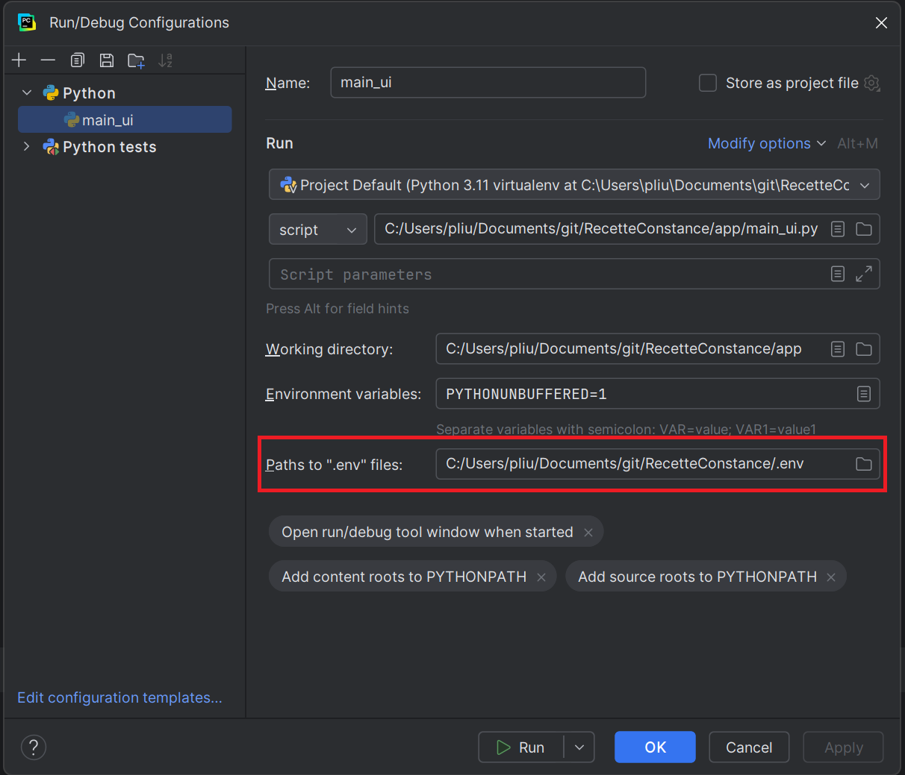

# Use pyspark on windows

In this tutorial, we will learn how to use pyspark in windows.

## 1. Setup python dev environment

In a dev environment, we recommend you to use `pyenv` to manage multiple version of python. The full doc on how to intall
pyenv is [here](https://github.com/pengfei99/Learning_Python/blob/main/docs/05.Install_pyenv_on_windows.md)

## 2. Create a python virtual environment

```powershell
# check the current python version
python -V

# create a virtual env
python -m venv <venv-name>

# activate the vir env
.\<venv-name>\Scripts\activate

# install pyspark
pip install pyspark==<version>
```

> The pyspark version must be the exact version of your spark. If the version does not match, it will not work.


## 3. Setup pyspark environment variable

As in pyspark code, you will have python code, so spark requires a `Python interpreter`. As a result, we need to set up
two environment variables **PYSPARK_PYTHON** and **PYSPARK_DRIVER_PYTHON**

### 3.1 Global setup

If you have only one python interpreter, you can use a global setup

```powershell
# set global env var
setx PYSPARK_PYTHON "C:\Users\<YourUser>\AppData\Local\Programs\Python\Python311\python.exe"
setx PYSPARK_DRIVER_PYTHON "C:\Users\<YourUser>\AppData\Local\Programs\Python\Python311\python.exe"

# check the new value, you may need to close and start a new powershell terminal
echo %PYSPARK_PYTHON%
echo %PYSPARK_DRIVER_PYTHON%
```

### 3.2 Per-project setup

If you have multiple python version installed, and each project requires a specific python and pyspark version, you can
use a powershell script to start your pyspark jobs

```powershell
<#
.SYNOPSIS
    Launches a Spark job with custom Spark, Hadoop, Java, and Python environments.
#>

# --- CONFIGURATION SECTION ---
# Define your project paths
$VENV_PATH      = ".\<venv-name>\Scripts\Activate.ps1"
$JDK_PATH       = "C:\Program Files\Eclipse Adoptium\jdk-17.0.11"
$SPARK_HOME     = "C:\Tools\spark\spark-3.5.2"
$HADOOP_HOME    = "C:\Tools\hadoop-3.4.2"
$SPARK_JOB_FILE = "spark_job.py"

# --- ENVIRONMENT SETUP ---

Write-Host "=== Activating Python virtual environment ==="
if (Test-Path $VENV_PATH) {
    & $VENV_PATH
} else {
    Write-Error "Virtual environment not found at $VENV_PATH"
    exit 1
}

# Get Python path from pyenv (falls back to venv if pyenv not used)
$pythonPath = ""
try {
    $pythonPath = (pyenv which python) 2>$null
} catch {}
if (-not $pythonPath) {
    $pythonPath = (Get-Command python).Source
}
$pythonPath = $pythonPath.Trim()

Write-Host "Using Python executable: $pythonPath"

# --- Export environment variables ---
$env:JAVA_HOME = $JDK_PATH
$env:SPARK_HOME = $SPARK_HOME
$env:HADOOP_HOME = $HADOOP_HOME
$env:PATH = "$env:JAVA_HOME\bin;$env:SPARK_HOME\bin;$env:HADOOP_HOME\bin;$env:PATH"
$env:PYSPARK_PYTHON = $pythonPath
$env:PYSPARK_DRIVER_PYTHON = $pythonPath

# --- VALIDATION ---
Write-Host "`n=== Environment summary ==="
Write-Host "JAVA_HOME     : $env:JAVA_HOME"
Write-Host "SPARK_HOME    : $env:SPARK_HOME"
Write-Host "HADOOP_HOME   : $env:HADOOP_HOME"
Write-Host "Python Path   : $env:PYSPARK_PYTHON"
Write-Host "Spark Job     : $SPARK_JOB_FILE"
Write-Host ""

# Confirm the Spark job file exists
if (-not (Test-Path $SPARK_JOB_FILE)) {
    Write-Error "Spark job file not found: $SPARK_JOB_FILE"
    exit 1
}

# --- RUN JOB ---
Write-Host "=== Starting Spark job ==="
& $pythonPath $SPARK_JOB_FILE
$exitCode = $LASTEXITCODE

if ($exitCode -eq 0) {
    Write-Host "`n✅ Spark job completed successfully."
} else {
    Write-Error "`n❌ Spark job failed with exit code $exitCode"
}

```

### 3.3 IDE setup

If you use an IDE(e.g. Pycharm, vscode), you can set up a `.env` file to set up customized spark, java, python, etc.
version for your project.

Below is an example of the `.env` file.

```.dotenv
# ==== PYTHON ENVIRONMENT ====
# Python interpreter managed by pyenv (used by both driver and executors)
PYSPARK_PYTHON=C:\Users\<User>\.pyenv\pyenv-win\versions\3.11.8\python.exe
PYSPARK_DRIVER_PYTHON=C:\Users\<User>\.pyenv\pyenv-win\versions\3.11.8\python.exe

# ==== JAVA ENVIRONMENT ====
# Java runtime for Spark and Hadoop
JAVA_HOME=C:\Program Files\Eclipse Adoptium\jdk-17.0.11
PATH=%JAVA_HOME%\bin;%PATH%

# ==== SPARK ENVIRONMENT ====
# Spark installation path
SPARK_HOME=C:\Tools\spark\spark-3.5.2
PATH=%SPARK_HOME%\bin;%PATH%

# ==== HADOOP ENVIRONMENT ====
# Hadoop home (needed for winutils and native libs)
HADOOP_HOME=C:\Tools\hadoop-3.4.2
PATH=%HADOOP_HOME%\bin;%PATH%

# ==== OPTIONAL SETTINGS ====
# Hadoop temp directory
HADOOP_TMP_DIR=%HADOOP_HOME%\tmp

# Log level (reduce Spark verbosity)
SPARK_LOG_LEVEL=INFO

# Local Spark master mode (auto-detect all cores)
SPARK_MASTER=local[*]

# Default filesystem (local)
HADOOP_CONF_DIR=%HADOOP_HOME%\etc\hadoop
SPARK_LOCAL_DIRS=C:\tmp\spark-temp
```

> To tell pycharm to load the `.env` file, you need to Go to `Run → Edit Configurations`. 
> Select your `Run/Debug configuration` for your Spark script.
> You will see a pop-up window like below. 
>



You need to enter your `.env` file, then save the configuration.

Next time, when you run the script, all the env var definition will be loaded first.

## 4. Simple test job

Below is a simple pyspark job which writes a dataframe in a parquet file on a local filesystem.

```python
from pyspark.sql import SparkSession
spark = SparkSession.builder.master("local[*]").getOrCreate()

data = [(1, "a"), (2, "b")]
df = spark.createDataFrame(data, ["id", "val"])
df.write.mode("overwrite").parquet("file:///C:/tmp/test_parquet")

print("Write OK")


```

## 5. Trouble shoot

### 5.1 java.io.IOException: Cannot run program "python3"

This error is caused by the way of how python and pyspark are installed in the OS. And how the env var is configured. 

Two possible solutions:
1. Set up an env var **PYSPARK_PYTHON** = python or the python executable path (works for linux, window, MacOS)
2. Before you create your spark session, add below instructions

```python
import os
import sys
from pyspark.sql import SparkSession

os.environ['PYSPARK_PYTHON'] = sys.executable
os.environ['PYSPARK_DRIVER_PYTHON'] = sys.executable
spark = SparkSession.builder.getOrCreate()
```